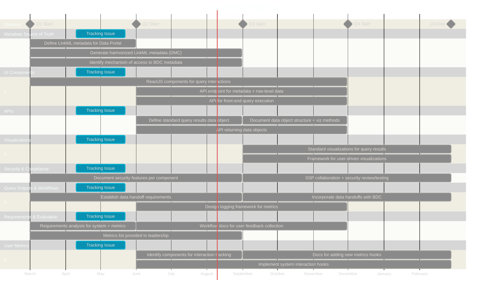

# Development Overview

This document contains the project development roadmap and milestone tracking for Study Palette (BDC Meta-Analysis Study Builder & Query Tool).

# Project Roadmap

**Note:** Quarter boundaries are approximate and will be adjusted when the project period is confirmed. Date ranges represent planned timeline slots for visual layout.

# GitHub Labels

## Project Area Labels

| Label | Description |
|-------|-------------|
| `Tracking` | Tracking issues for development and reporting |
| `Metadata Source of Truth` | LinkML metadata, semantic bindings, query engine |
| `UI Components` | ReactJS interface components |
| `APIs` | Modular API services |
| `Visualizations` | Visualization widgets |
| `Security & Compliance` | NIST/FedRAMP/HIPAA compliance |
| `Query Outputs` | Transportable query results and workflows |
| `Requirements & Evaluation` | Requirements analysis and usability |
| `User Metrics` | Interface hooks and interaction tracking |

## Workflow Labels

| Label | Description |
|-------|-------------|
| `Infrastructure` | CI/CD, repo tooling, dev environment |
| `Documentation` | Docs, architecture decisions, onboarding |
| `Future` | Future work — not on current roadmap |

# Project Outline

Each section corresponds to a Gantt chart section and will have an associated GitHub tracking issue.

## 1. Metadata Source of Truth

Comprehensive, machine-readable metadata and scalable query services for BDCHM-compliant data.

- [ ] Define structured LinkML metadata required for Data Portal (Q1)
- [ ] Generate harmonized LinkML metadata files via DMC Data Ingestion (Q1–Q2)
- [ ] Identify mechanism of access to BDC computational metadata (Q1–Q2)

## 2. UI Components

Open-source library of reusable interface components.

- [ ] ReactJS components for user interactions with query components (Q1–Q3)
- [ ] API endpoint for metadata files and row-level BDC data (Q2–Q3)
- [ ] API for processing front-end interactions to execute queries against BDC (Q2–Q3)

## 3. APIs

Open-source library of reusable APIs.

- [ ] Define standard data object for query results (Q2)
- [ ] API capable of returning data objects (Q2–Q3)
- [ ] Document data object structure and methods for data visualizations (Q3)

## 4. Visualizations

Open-source library of visualization widgets.

- [ ] Standard visualizations for all query results (Q3–Q4)
- [ ] Framework for adding user-driven visualizations (Q3–Q4)

## 5. Security & Compliance

Security and compliance features for each component.

- [ ] Document security and compliance features per component and BDC integration (Q1–Q2)
- [ ] Collaborate with NIH on SSP and security review/testing (Q3–Q4)

## 6. Query Outputs & Workflows

Standardized, logged, transportable query results for use in the BDC ecosystem.

- [ ] Establish requirements of data handoffs to other BDC components (Q1–Q2)
- [ ] Design logging framework based on metrics requirements (Q2–Q3)
- [ ] Incorporate data handoffs with BDC components into Data Portal (Q3–Q4)

## 7. Requirements & Evaluation

Formal requirements analysis for interfaces and workflows.

- [ ] Requirements analysis to define desired system functionality and metrics (Q1)
- [ ] Metrics list with descriptions provided to leadership (Q1–Q2)
- [ ] Workflow documentation for user feedback collection (Q2–Q3)

## 8. User Metrics

Interface hooks to collect system interactions and generate user metrics.

- [ ] Identify relevant interface components for interaction tracking (Q2)
- [ ] Implement system interaction hooks for prioritized metrics (Q2–Q4)
- [ ] Supporting documentation for adding new hooks (Q3–Q4)
